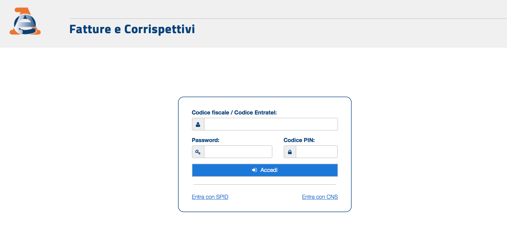
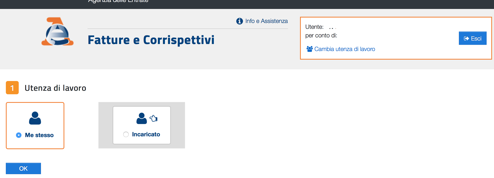

### Fatturazione Elettronica tramite Agenzia delle entrate

Il presente documento è una wiki per accedere al servizio di fatturazione elettronica e conservazione sostitutiva messo a disposizione dall'agenzia delle entrate. 
I servizi sono assolutamente gratuiti

Per accedere al servizio sono necessari i seguenti prerequisiti

* Essere in possesso di un'identità digitale personale qualsiasi tra quelle elencate
  * Carta Nazionale dei servizi (CNS) tramite token USB 
  * Carta Nazionale dei servizi (CNS) tramite SmartCard (es. tessera sanitaria per regione lombardia)
  * SPID Identità digitale che si può richiedere alla propria camera di commercio oppure tramite i player abilitati (aruba, namirial, intesa etc)
* Essere registrati all'area Fisconline https://telematici.agenziaentrate.gov.it/Main/Registrati.jsp
* Richiedere l'abilitazione del proprio utente personale a poter operare per una società
  * Questo passaggio è fondamentale altrimenti non si riesce ad operare per una società ma solo come persona fisica. Questa cosa deve essere fatta nell'apposita Area Riservata presente sulla home page del portale della AdE entrando nella sezione Fisconline https://spid.sogei.it/SPIDManagerWeb/loginServiziTelematici.html. Per questa abilitazione servono circa 2/3 giorni dopo la richiesta prima che si venga abilitati.

E' necessario infatti sapere che quando si accede all'agenzia delle entrate si accede sempre come persona fisica. La persona fisica poi sarà abilitata ad operare per una o più società.

### Accesso al portale Agenzia delle entrate

Per accedere al portale 

https://www.agenziaentrate.gov.it/wps/portal/entrate/home

Dalla home del sito andare fino alla fine della pagina. In basso a destra c'e' il seguente link 
https://ivaservizi.agenziaentrate.gov.it/portale/ denominato Fatture e Corrispettivi.

A questo punto serve la nostra identità digitale per poter accedere all'area riservata.
Inserendo le credenziali si accede al portale dove è possibile effettuare tutte le operazioni sulla fatturazione.

E' necessario selezionare Incaricato se si vuole operare per conto della società.

Dopo aver selezionato incaricato compare la scelta del codice fiscale della società per cui operare

N.B. Se in questa maschera compare solo Me Stesso è necessario prima richiedere il pin per la propria società andando ad abbinare il proprio codice fiscale personale con la partita iva della propria azienda. 

****

Dopo aver scelto la società e aver dato conferma sulla form dell'utenza di lavoro selezionata si entra nella propria scheda da dove è possibile effettuare tutta una serie di operazioni

* Generazione QR CODE

* Generazione fatture, invio a SDI, consultazione.

* Possibilità di aderire al servizio di conservazione sostitutiva

* Impostare indirizzo telematico dove vogliamo ricevere le fatture (codice destinatario o pec aziendale)

Il presente documento non è sicuramente esaustivo e per quanto riguarda tutte le procedure si rimanda comunque al sito dell'agenzia delle entrate e ai numerosi video presenti sul portale di assistenza.

